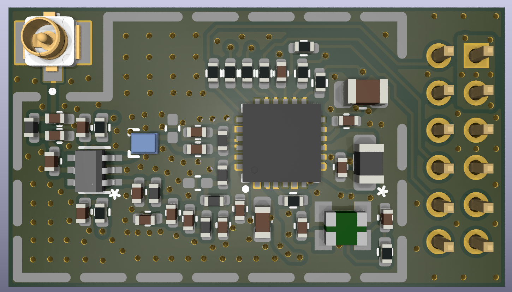
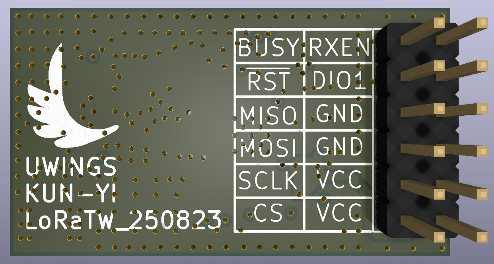

# LoRa-TW

**LoRa-TW** is a hardware project designed in **KiCAD** targeting LoRa applications in the Taiwan frequency band(AS923, 920MHz ~ 925MHz).
The design is based on the **Semtech SX1262** transceiver, optimized for robust operation in noisy RF environments.

## Project Purpose
This project aims to provide a reliable LoRa module reference design for Taiwan (center frequency **922.5 MHz**).
To improve receiver robustness, an external **SAW filter** is introduced in the RX path to mitigate interference from nearby cellular communication bands.

## Key Features
- **RF Core**: Semtech SX1262
- **T/R Switch**: PSemi RF switch
- **Filtering**: QUALCOMM SAW filter (optimized for 922.5 MHz center frequency)
- **Powering**: DC-DC mode operation
- **Form Factor**: 12-pin 2.0mm breakout for easy integration

## Pinout
| Pin | Name   | Description                   |
|-----|--------|-------------------------------|
| 1   | VDD    | Power supply                  |
| 2   | CS     | Chip Select                   |
| 3   | VDD    | Power supply                  |
| 4   | SCLK   | SPI Clock                     |
| 5   | GND    | Ground                        |
| 6   | MOSI   | SPI Data (Master Out)         |
| 7   | GND    | Ground                        |
| 8   | MISO   | SPI Data (Master In)          |
| 9   | DIO1   | Interrupt / IRQ               |
| 10  | /RESET | Reset                         |
| 11  | RXEN   | RX Enable (T/R Switch)        |
| 12  | BUSY   | SX1262 Busy status            |

## Repository Contents
- `LoRa-TW.kicad_pcb` - KiCAD project
- `LoRa-TW.kicad_sch` – KiCAD schematic files
- `LoRa-TW.kicad_pcb` – KiCAD PCB layout files

## Author
**KUN-YI CHEN**,
📧 [kunyi.chen@gmail.com](mailto:kunyi.chen@gmail.com)

- **Current Version:** v1 (250823) – First release of the hardware design.
- **Status:** Schematic and PCB completed, awaiting validation and testing.
- **Planned Improvements:**
  - Conduct full RF testing and verification in Taiwan ISM band.
  - Optimize layout for improved RF isolation and matching.

## License
This project is licensed under the **CERN Open Hardware License v2 - Strongly Reciprocal (CERN-OHL-S-2.0)**.
You are free to use, modify, and distribute this design, but derivative works must also be shared under the same license.

For details, see the [LICENSE](LICENSE) file.
